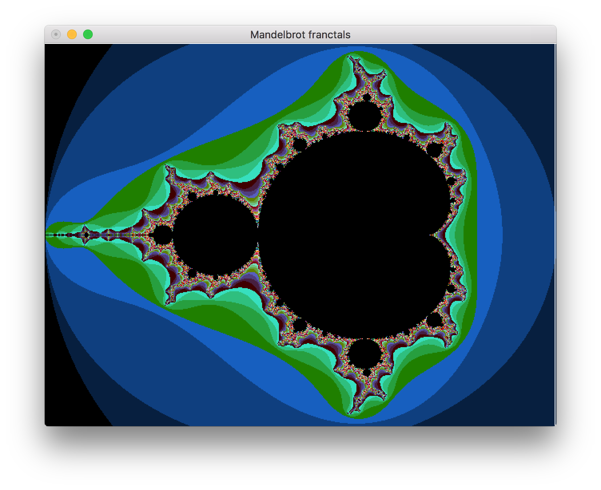
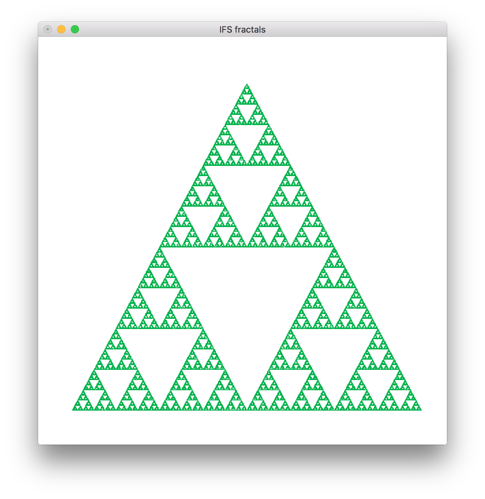
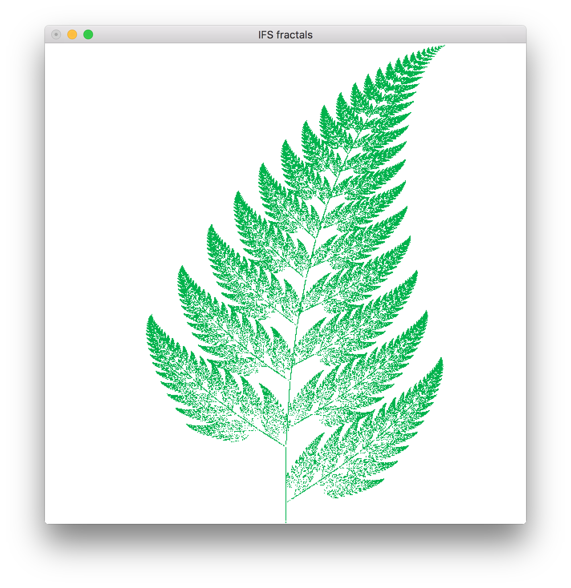
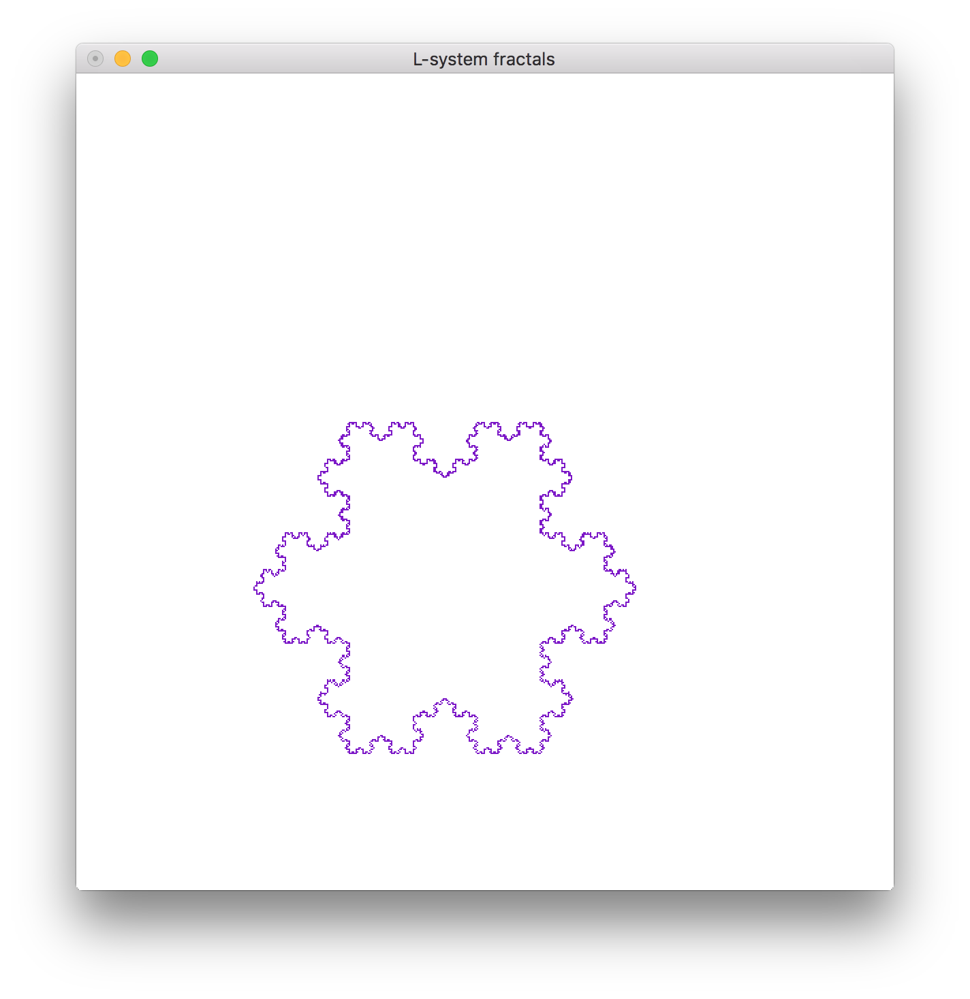
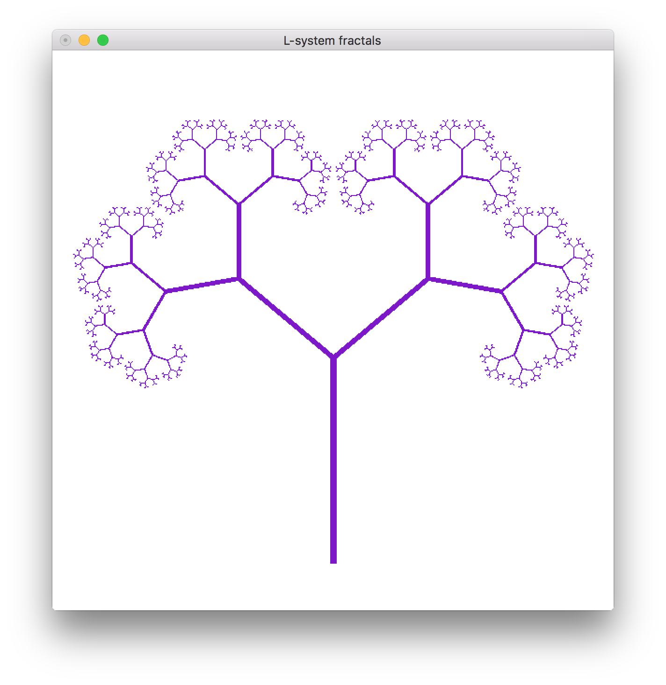
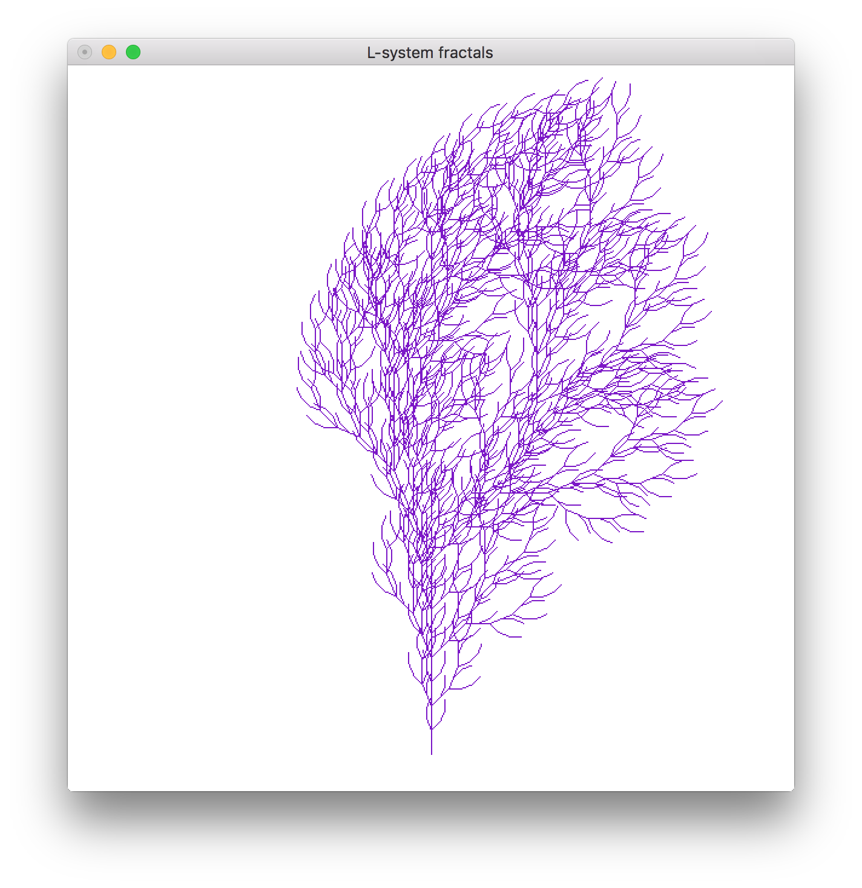
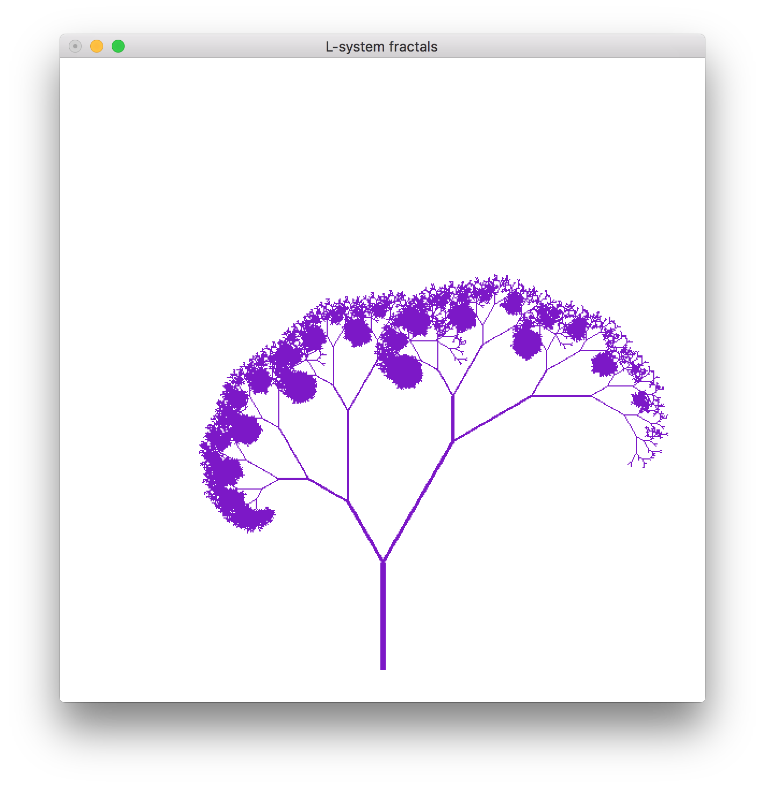
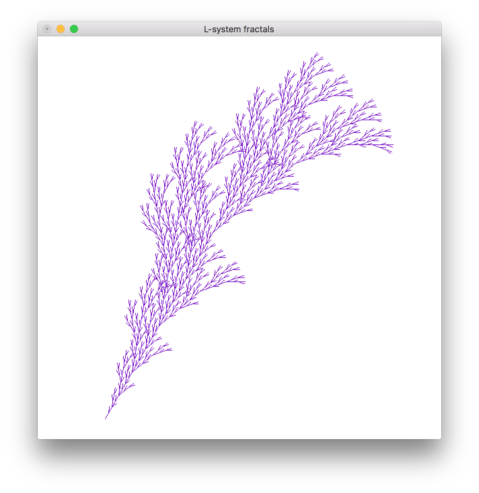

# Three different fractal implementations

## Images

### [Mandelbrot](https://github.com/filiphrenic/fractals/tree/master/mandelbrot)

### [Iterated Function System (IFS) fractals](https://github.com/filiphrenic/fractals/tree/master/ifs)
#### Sierpinski

#### Paprat

### [L-system fractals](https://github.com/filiphrenic/fractals/tree/master/lsystem)
#### Koch snowflake

#### Other examples of L-systems

License
---------
MIT License

Copyright (c) 2016 Filip Hrenić
